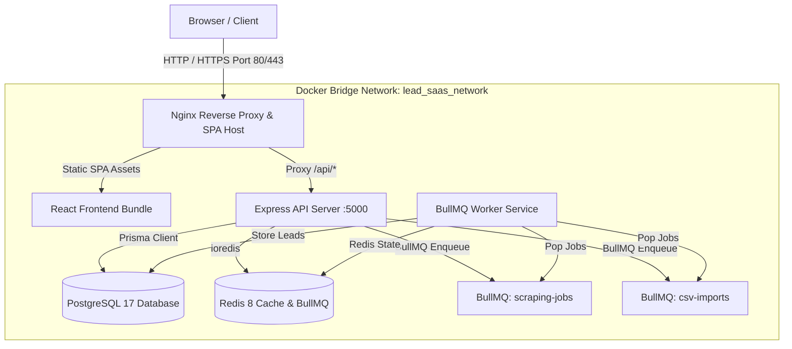

# Production Deployment & Operational Guide

## Overview

This guide provides instructions for deploying, operating, backing up, and scaling the US Business Lead SaaS platform in a production environment.

---

## Architecture Diagram



---

## Deployment Steps

### 1. Prerequisites

- Linux server (Ubuntu 22.04 LTS or newer recommended)
- Docker 24+ and Docker Compose v2+
- Domain name with DNS pointing to server IP
- Valid TLS certificates (Let's Encrypt / Certbot or Managed LB)

### 2. Environment Setup

1. Clone the repository on the target server:
   ```bash
   git clone https://github.com/Mujtabawebdev/Scraper.git /opt/us-business-lead-saas
   cd /opt/us-business-lead-saas
   ```

2. Create the production environment configuration file:
   ```bash
   cp .env.production.example .env
   ```

3. Populate secure secrets in `.env`:
   - Generate 64-byte random JWT secrets:
     ```bash
     openssl rand -base64 64
     ```
   - Set `JWT_ACCESS_SECRET` and `JWT_REFRESH_SECRET`
   - Set strong `POSTGRES_PASSWORD` and `REDIS_PASSWORD`
   - Set `FRONTEND_URL=https://leadsaas.example.com`
   - Set `AUTH_COOKIE_SECURE=true` and `AUTH_COOKIE_DOMAIN=leadsaas.example.com`
   - Configure Stripe live API keys and webhook secret if billing is enabled

### 3. Launching Production Containers

Start the full stack with Docker Compose:

```bash
docker compose up -d
```

Check service status:

```bash
docker compose ps
```

Verify service logs:

```bash
docker compose logs -f api
docker compose logs -f worker
docker compose logs -f nginx
```

---

## Database Migration Workflow

The deployment stack automatically runs a one-shot `migration` container using `npx prisma migrate deploy` before the `api` and `worker` services start.

### Manual Migration Check

To inspect migration status manually:

```bash
docker compose run --rm migration npx prisma migrate status --schema apps/api/prisma/schema.prisma
```

### Forward-Fix Migration Policy

- **Never** run `prisma migrate dev` or `prisma migrate reset` in production.
- If a migration fails in production:
  1. Inspect logs: `docker compose logs migration`
  2. Fix the SQL migration file or underlying database constraint.
  3. Re-deploy with a forward fix migration script.

---

## Backup & Disaster Recovery

### PostgreSQL Backup Procedure

Run an automated `pg_dump` backup:

```bash
mkdir -p /opt/backups/postgres
TIMESTAMP=$(date +%Y%m%d_%H%M%S)
docker exec lead-saas-postgres pg_dump -U lead_user -d us_business_leads -F c -f /tmp/backup.dump
docker cp lead-saas-postgres:/tmp/backup.dump /opt/backups/postgres/lead_saas_${TIMESTAMP}.dump
docker exec lead-saas-postgres rm /tmp/backup.dump
```

### PostgreSQL Restore Procedure

To restore from a `.dump` backup file:

```bash
docker cp /opt/backups/postgres/lead_saas_20260724_120000.dump lead-saas-postgres:/tmp/restore.dump
docker exec -i lead-saas-postgres pg_restore -U lead_user -d us_business_leads --clean --if-exists /tmp/restore.dump
docker exec lead-saas-postgres rm /tmp/restore.dump
```

### Redis Data Recovery

- Redis uses AOF (`appendonly yes`) stored in the `redis_data` Docker volume.
- Redis queues and temporary cache keys are disposable. Active scraping jobs automatically retry from BullMQ state.

---

## Horizontal Scaling

### Scaling API Instances

Scale API containers behind Nginx:

```bash
docker compose up -d --scale api=3
```

### Scaling Worker Instances

Scale BullMQ workers for increased processing capacity:

```bash
docker compose up -d --scale worker=2
```

> **Note:** Worker concurrency is governed by `WORKER_CONCURRENCY` in `.env`. Keep concurrency low (default `2`) to strictly obey source rate limits and domain compliance policies.

---

## Secret Rotation Policy

1. **JWT Secrets**: Updating `JWT_ACCESS_SECRET` or `JWT_REFRESH_SECRET` in `.env` will immediately invalidate all outstanding user sessions. Users will be prompted to log in again.
2. **Database Passwords**: Update `POSTGRES_PASSWORD` in `.env` and run `docker compose up -d` to restart services with updated connection strings.
